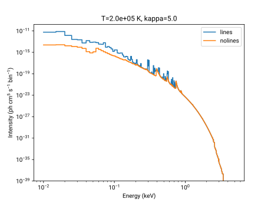
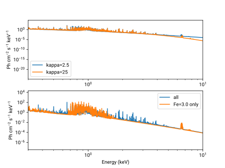

============
Introduction
============
The AtomDB Kappa model is designed to create spectra for spectra with non-Maxwellian electron distributions of electron energies. The coefficients of Hahn and Savin [1]_ are used to create similar electron distributions from a sum of Maxwellian electron distributions. 

Given the available atomic data in AtomDB and other similar databases, it is important to ensure that the Maxwellian temperatures required to model the spectrum are present in the underlying atomic spectra database. Important work on this, including exploring the validity of the approximations is in [2]_. Note that there are no warnings included in this package for when you enter into areas where the model is not particularly valid.

============
How it Works
============

The AtomDB Kappa model uses the non-equilibrium emissivity data from the AtomDB project, combined with their ionization and recombination rates (mostly from [3]_) to determine the spectrum. When a spectrum is required, the following steps are carried out:

1. The Hahn and Savin coefficients are calculated, to seee what Maxwellian temperatures (Tm) are required and with what normalizations to create the kappa distribution

2. The ionization and recombination rates are calculated at each Tm, and then summed to provide kappa ionization and recombination rates. For Tm outside the nominal 10^4 to 10^9 Kelvin range of AtomDB data, the ionization and recombination data can be extrappolated fairly safely.

3. The ionization fraction for each ion is calculated using these kappa ionization and recombination rates

4. For each ion present in the resulting ionization fraction, the spectrum is calculated at each Tm and then summed appropriately to give a final specturm. As spectra cannot easily be extrappolated, and Tm outside 10^4 to 10^9 K are ignored. Again, this can lead to unrealistic results. 

.. [1] Hahn and Savin (2015) `2015ApJ...800...68H <https://ui.adsabs.harvard.edu/abs/2015ApJ...800...68H/abstract>`_
.. [2] Cui, Foster, Yuasa and Smith (2019), `2019ApJ...887..182C <https://ui.adsabs.harvard.edu/abs/2019ApJ...887..182C/abstract>`_
.. [3] Bryans (2009) `2009ApJ...691.1540B <https://ui.adsabs.harvard.edu/abs/2009ApJ...691.1540B/abstract>`_

=======================
Installation
=======================

Requires:

python 3
pyatomdb >= 0.8.0
numpy
astropy
scipy

pylab for demonstration

No installation necessary. Make sure the folder is somewhere in your python path (or start python from within this directory). 

kappa.py contains the code. Suggested to start new code with "import kappa" and then take it from there.

There is a wrapper for XSPEC, kappa_xspec.py. See test_kappa.py for a quick example of loading the 3 models into xspec.

=====
Usage
=====

Mostly just make a kappa object, then call it

.. literalinclude:: test_kappa_noxspec.py
  :language: python3

    Kappa Module Example
    
-----
XSPEC
-----

To use the model in XSPEC, one can ignore the class details above. Unfortunately, the code only works with the XSPEC python interface, pyxspec_ for now. Before loading the code, you will need to edit the ``kappa_xspec.py`` file to change the data file paths.

The kappa_xspec module contains all you need to load the kappa model into XSPEC. From a python3 shell:

.. code-block:: python

  from kappa_xspec import *

Once this is done, the data will load.

Three different models are loaded:

- pykappa : Emission from kappa spectrum with the 14 main elements. Abundance is tied between all elements (so there is only 1 abundance keyword). Analogous to the apec model.
- pyvkappa : Emission from kappa spectrum with the 14 main elements. Abundance is free to vary between all the elements (though it starts frozen). Analagous to the vapec model.
- pyvvkappa : Emission from 27 elements, H through Ni excluding Co. Abundance is free to vary between all the elements.

.. note::
  Note that in the kappa and vkappa cases, unlike in the apec and vapec models, the effective abundance of the minor recombining elements is 0, not solar. This speeds up calculation time and does not significantly affect the resulting emission.

Once you have this, models can be used in pyxspec in the usual way, e.g.

.. code-block:: python

  m = xspec.Model('tbabs(pow+pykappa)')

++++++++++++++++
Model parameters
++++++++++++++++

+--------------+-----------------------------------------------------------------------------------+
| Parameter    | Definition                                                                        |
+==============+===================================================================================+
| kT           | Plasma temperature (keV). Used for recombining particle ion fraction              |
+--------------+-----------------------------------------------------------------------------------+
| kappa        | The degree of non-Maxwellianness of the electrons                                 |
+--------------+-----------------------------------------------------------------------------------+
| abund        | recombining elemental abundances. (given by individual element in pyvkappa and pyvvkappa) |
+--------------+-----------------------------------------------------------------------------------+

An example of using the model in xspec:

.. literalinclude:: test_kappa.py

    Kappa module example with XSPEC

===============
Version History
===============
0.1.0
May 27th 2019
Initial release

0.2.0
July 9th 2019
Error in the ionization balance calculation fixed.

0.3.0
February 7th 2020
Found minor error in published H&S table, affecting Kappa > 18. Fixed.
Converted interface to pyatomdb sepectrum module updates from pyatomdb v0.8

1.0.0
March 6th 2020
Released at version 1.0.0. No other changes to 0.3.0

1.1.0
August 2nd 2020
Updated interfaces to work with updated pyatomdb 0.10.0 and later

1.1.1
October 23rd 2020
Bugfix to allow model to load with new pyatomdb interface (thank you to Anna Ogorzalek)

1.2.0
# November 2nd 2020
Fixed error in hahnsavin.fits file affecting 5.2<=kappa<7.3. (wrong value was in published paper, right value was in accompanying IDL code)
Recoded much of the Session and Spectrum process to use the same routines as the NEISpectrum and NEISession classes in pyatomdb
Made the return_line_emissivity and return_linelist functions work
Made dolines, docont and dopseudo keywords work

.. _pyxspec: https://heasarc.gsfc.nasa.gov/xanadu/xspec/python/html/index.html

